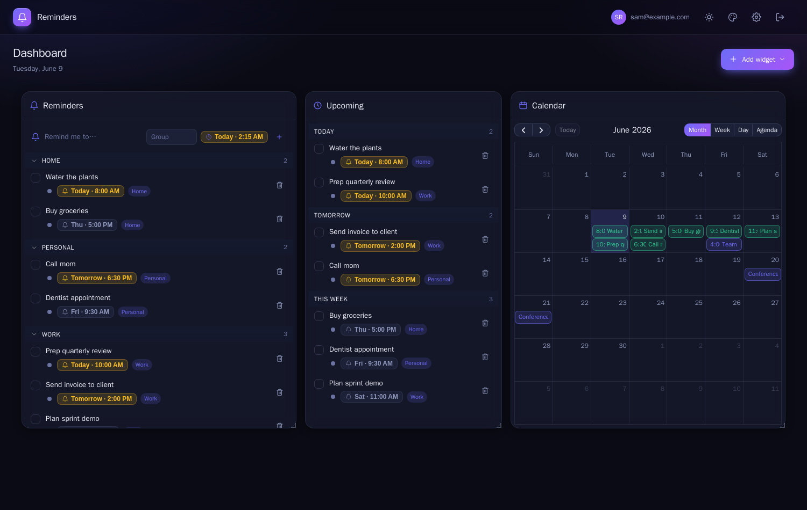
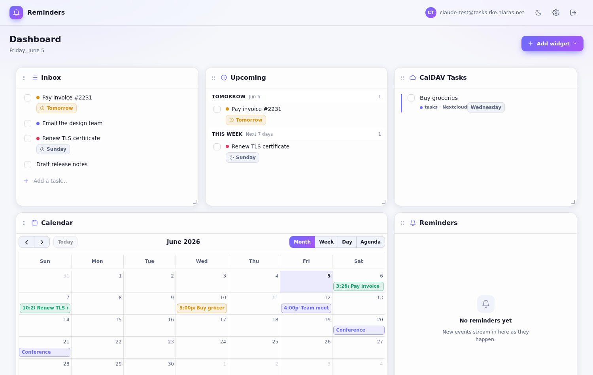
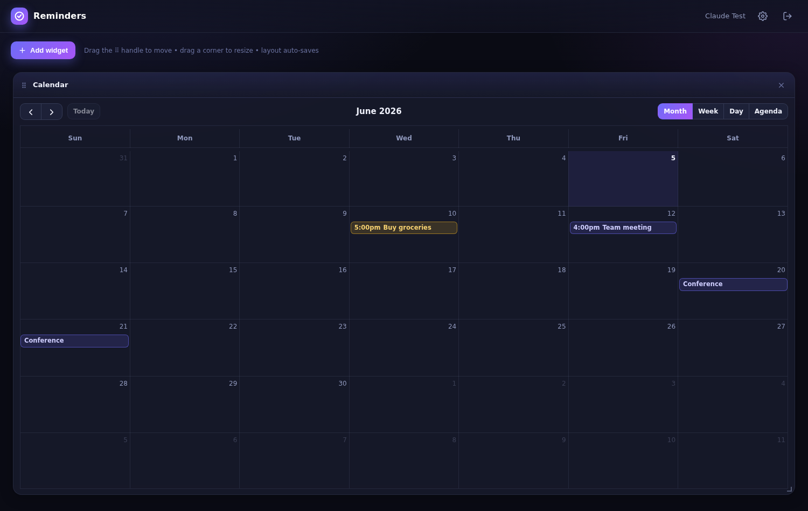
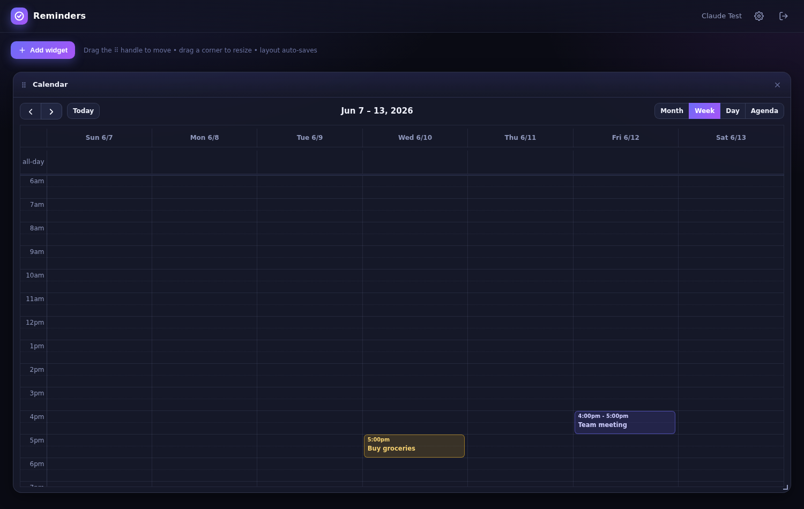
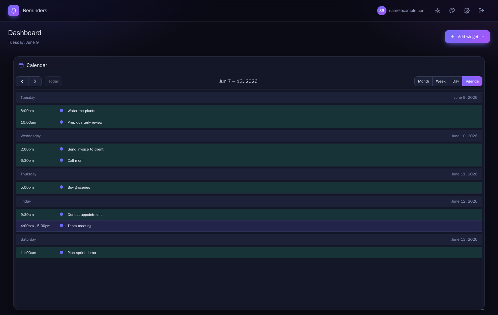
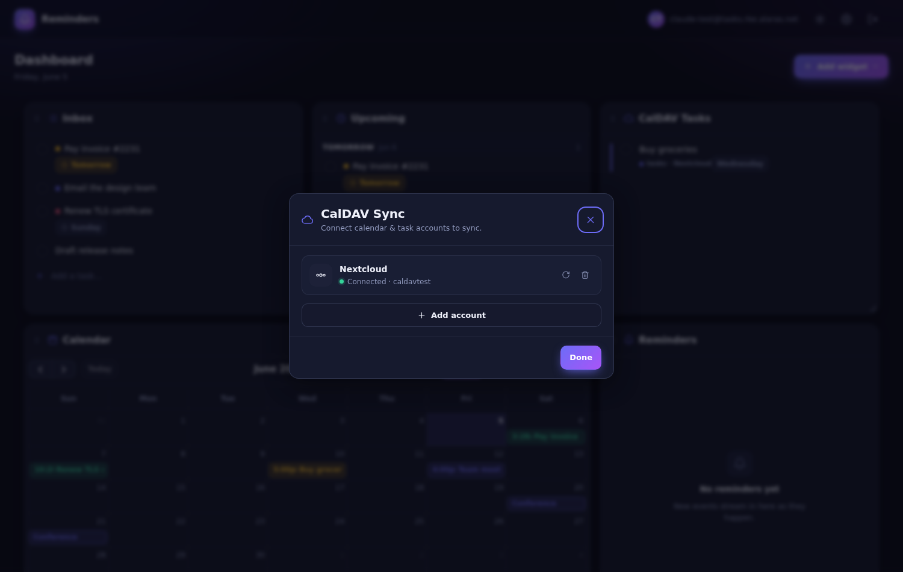
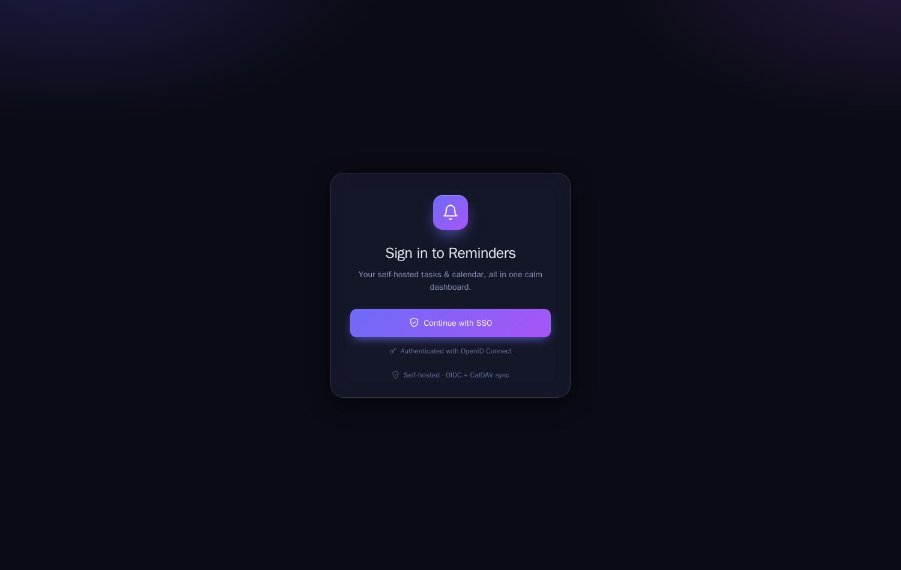
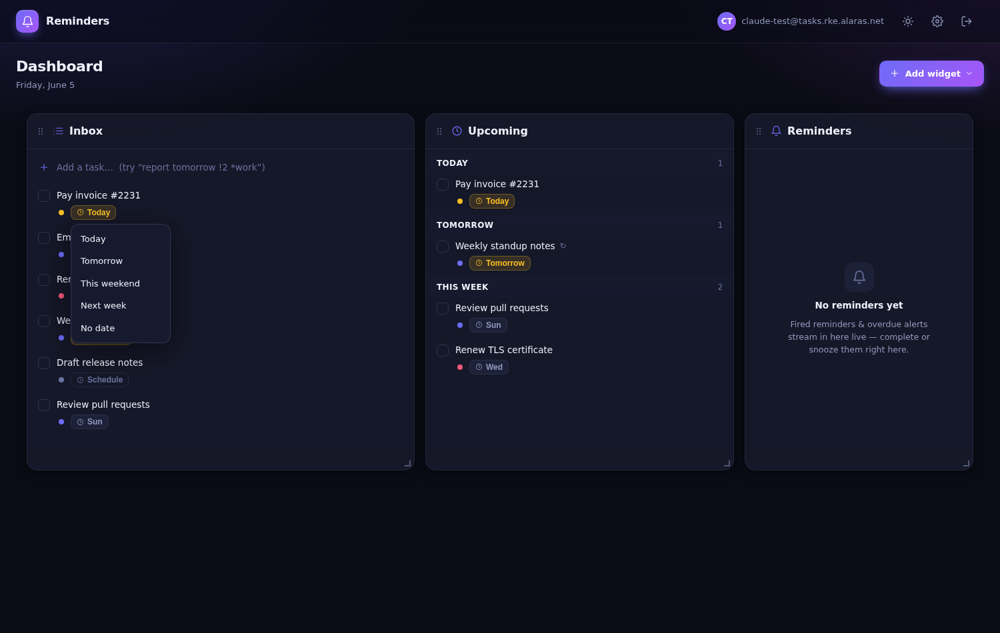

# Reminders

A self-hosted, customizable **task + calendar dashboard** — a personal "command center" you actually own. Drag-and-drop resizable widgets backed by **CalDAV** (Nextcloud / Apple iCloud / generic) — your tasks, reminders and events live in your own server — with a multi-view calendar, **OIDC single sign-on**, and a light/dark theme, all running on your own infrastructure. Heavily relied on AI for the code generation.

> 📖 **Full documentation is in the [project wiki](https://github.com/Adithya-Rajendran/reminders-app/wiki)** — architecture, deployment (Kubernetes / Docker), configuration, OIDC, CalDAV, and development.

[](https://github.com/Adithya-Rajendran/reminders-app/actions/workflows/ci.yml)
[](https://github.com/Adithya-Rajendran/reminders-app/actions/workflows/docker.yml)


> Personal, non-commercial project. Built on FOSS; see [licensing](#licensing).

---

## Screenshots

|  |  |
|---|---|
| **Dashboard — dark** | **Dashboard — light** |
|  |  |

**Multi-view calendar** (month / week / agenda — your CalDAV events and reminders in one place)

| Month | Week | Agenda |
|---|---|---|
|  |  |  |

| **CalDAV Sync settings** | **SSO login** |
|---|---|
|  |  |

**Interactive tasks** — natural-language quick-add, one-click scheduling (popover open) & priority, recurring badges, grouped Upcoming, actionable reminders



---

## Features

- 🧩 **Customizable dashboard** — draggable, resizable widget grid ([react-grid-layout](https://github.com/react-grid-layout/react-grid-layout)); arrange it however you like, layout auto-saves per user.
- ✅ **Task widgets** backed by **CalDAV** — your tasks live as VTODOs in your own server (Nextcloud / iCloud / any CalDAV); projects are your task calendars and an **Upcoming** view groups by Today / Tomorrow / This week. Recurrence (RRULE) and reminders (VALARM) round-trip and sync to your devices.
- ⚡ **Interactive tasks** (influenced by Todoist / TickTick / Things) — **natural-language quick-add** (`report tomorrow !2 *work` → due date + priority + label), one-click **scheduling** (Today / Tomorrow / Weekend / Next week / clear) and **priority** menus, **recurring-aware** completion with a satisfying pop + **Undo**, **drag tasks on the calendar** to reschedule, and an **actionable reminders feed** (complete / snooze).
- 📅 **Multi-view calendar** ([FullCalendar](https://fullcalendar.io)) — month / week / day / agenda; create, drag-reschedule, edit & delete events; tasks overlay automatically.
- ☁️ **CalDAV sync** — connect **Nextcloud**, **Apple iCloud**, or any **generic CalDAV** server; discover task lists, toggle which to sync, read & complete tasks, two-way calendar **events** (VEVENT) write-back.
- 🔔 **Live reminders feed** — a poller over your CalDAV VALARMs → **per-user** SSE → instant in-app updates (the alarms also fire natively on your devices).
- 🔐 **OIDC single sign-on** (Authentik / Keycloak / any OpenID Connect provider) via a backend-for-frontend; sessions persisted in a small local SQLite file.
- 🎨 **Light & dark themes + selectable accents** — a one-click theme toggle and an 8-swatch **accent picker** in the top bar, both persisted per browser.

## How it works

```
Browser ──TLS──▶ Gateway/Ingress ──▶ Reminders (Node BFF + React SPA)
                                         │  OIDC (PKCE) ──▶ your IdP
                                         │  tasks/projects/labels/recurrence/reminders ─▶ CalDAV (Nextcloud/iCloud/…)
                                         │  calendar events (VEVENT) ─▶ CalDAV
                                         │  layouts + account config + sessions ─▶ SQLite (local file)
                                         ▼
                       VALARM poller ─▶ per-user SSE
```

The **BFF** (`app/server`, Node + Express) does server-side OIDC, keeps an HttpOnly session, and is a thin layer over **CalDAV**: tasks/projects/labels/recurrence/reminders are VTODOs in the user's own CalDAV server (via [tsdav](https://github.com/natelindev/tsdav) + [ical.js](https://github.com/kewisch/ical.js)), giving real multi-tenancy and device sync for free. A small **SQLite** file (WAL, on a block volume) holds only what's easy to recreate — dashboard layouts, encrypted CalDAV account config, and sessions. A **VALARM poller** pushes per-user SSE reminders. The **SPA** (`app/client`, React 19 + Vite) is the dashboard. See the **[wiki → Architecture](https://github.com/Adithya-Rajendran/reminders-app/wiki/Architecture)** for the full design.

## Quick start (container image)

The image is published to GHCR by CI:

```bash
docker run -p 8080:8080 -v reminders-data:/data \
  -e SESSION_SECRET="$(openssl rand -hex 32)" \
  -e CONFIG_DB_PATH=/data/config.db \
  -e OIDC_ISSUER="https://idp.example.com/application/o/reminders/" \
  -e OIDC_CLIENT_ID=... -e OIDC_CLIENT_SECRET=... \
  -e OIDC_REDIRECT_URI="https://reminders.example.com/auth/callback" \
  -e APP_BASE_URL="https://reminders.example.com" \
  -e CALDAV_ENC_KEY="$(openssl rand -hex 32)" \
  ghcr.io/adithya-rajendran/reminders-app:latest
```

Needs only a writable volume for the SQLite config DB (`CONFIG_DB_PATH`) and an **OIDC** provider — no database server. Register the OAuth2 redirect URI with your IdP; each user links their own CalDAV account in-app (Settings). Optional: `REMINDER_POLL_MS` (VALARM poll interval, default 60000); `CALDAV_BLOCK_PRIVATE=1` to also block RFC1918 destinations for the CalDAV egress guard.

### Kubernetes

Example manifests are under [`k8s/`](k8s/) (namespace, a 1Gi PVC for the SQLite config DB, the app, and a route). They run on **any conformant cluster** — set your own StorageClass, ingress/Gateway, and hostname. SQLite needs **block** storage (not a shared filesystem like NFS/CephFS) for safe WAL locking, and the Deployment uses `Recreate` since the `ReadWriteOnce` volume can't be multi-attached. Create the `reminders-app-env` secret, then `kubectl apply -f k8s/`. The app pulls **`ghcr.io/adithya-rajendran/reminders-app:latest`** (built & pushed by CI). See the **[wiki → Deployment on Kubernetes](https://github.com/Adithya-Rajendran/reminders-app/wiki/Deployment-on-Kubernetes)** for a full, generic walkthrough.

## Development

```bash
cd app
npm install
npm run dev      # Vite dev server (proxies /api & /auth to a running BFF)
npm run build    # build the SPA into app/public
npm run lint     # ESLint
npm start        # run the BFF (serves app/public)
```

CI (`.github/workflows/ci.yml`) runs lint, the SPA build, the server syntax check, unit + component tests, the same checks inside the Docker image's `test` stage **plus a boot smoke of the production image**, and a Playwright e2e suite against real CalDAV (Radicale) and WebDAV (wsgidav) backends — on every push/PR. `docker.yml` boot-tests and then pushes the image to GHCR on `main` and tags, and the optional `deploy.yml` can roll a cluster automatically afterwards (see [`k8s/README.md`](k8s/README.md)). **Everything runs on GitHub-hosted runners (free for public repos) — no self-hosted runner, VM, or cluster is required or used by CI.**

**Extending the dashboard:** widgets are self-contained — one component file plus one entry in `app/client/src/widgets/registry.jsx`. See **[docs/adding-a-widget.md](docs/adding-a-widget.md)** for the walkthrough, [docs/api.md](docs/api.md) for the `/api/*` contract widgets couple to, and [`CLAUDE.md`](CLAUDE.md) for a map of the repo.

## Design

Theme tokens for both light and dark themes live in `app/client/src/styles.css`; icons are inline SVG in `app/client/src/icons.jsx`.

## Licensing

The app's own components are FOSS and permissive (MIT/Apache/MPL: React, FullCalendar, react-grid-layout, tsdav, ical.js, Express, better-sqlite3…). Nextcloud (AGPL) is reached only as an external CalDAV server you run yourself. Not legal advice. Don't run this as a multi-tenant/commercial service without reviewing each component's license.

## Acknowledgements

[FullCalendar](https://fullcalendar.io) · [react-grid-layout](https://github.com/react-grid-layout/react-grid-layout) · [tsdav](https://github.com/natelindev/tsdav) · [ical.js](https://github.com/kewisch/ical.js) · [Authentik](https://goauthentik.io) · [Nextcloud](https://nextcloud.com).
